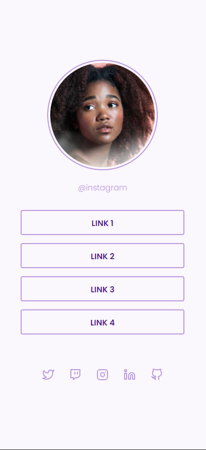

<h1 align="center"> Social Tree </h1>

Desafio da Rocketseat de criação de uma página de links sociais.  
Fizemos esse projeto em um grupo de estudos.

  

 

## 🚀 Tecnologias

Esse projeto foi desenvolvido com as seguintes tecnologias:

- HTML e CSS
- Git e Github
- Figma
- Semantic HTML5 markup
- CSS custom properties
- Flexbox

## 🚀 Preview site

- [Clique aqui](https://nicoledpizetta.github.io/SocialTree-EstudoEmGrupo/)

## 🚀 Screenshots

#### Desktop

#### Mobile

## 🚀 Recursos úteis

- [Notion do Desafio](https://efficient-sloth-d85.notion.site/Desafio-Social-Tree-a4008e467a3248c4b05c97cf78aea44f)

## 🚀 Layout

Você pode visualizar o layout do projeto através [DESSE LINK](https://www.figma.com/file/yi1ycIyAW8QiGiX9bMFHkU/DD-%2F-Social-links/duplicate). É necessário ter conta no [Figma](https://figma.com) para acessá-lo.

## :memo: Licença

Esse projeto está sob a licença MIT.

---

### Feito com ♥ por:

- [@NicoleDPizetta](https://github.com/NicoleDPizetta)
- [@FlightofIcarus](https://github.com/FlightofIcarus)
- [@VictorPz](https://github.com/VictorPz)
- [@matheusntv](https://github.com/matheusntv)
- [@MarviLouz](https://github.com/MarviLouz)
- [@SamuelMagalhaes](https://github.com/SamuelMagalhaes)
- [@hiagxrosa](https://github.com/hiagxrosa)
- [@gustavoiktn](https://github.com/gustavoiktn)

 :wave: <a align="center" href="https://discord.gg/rocketseat">Participe da comunidade Rocketseat!</a>

---
